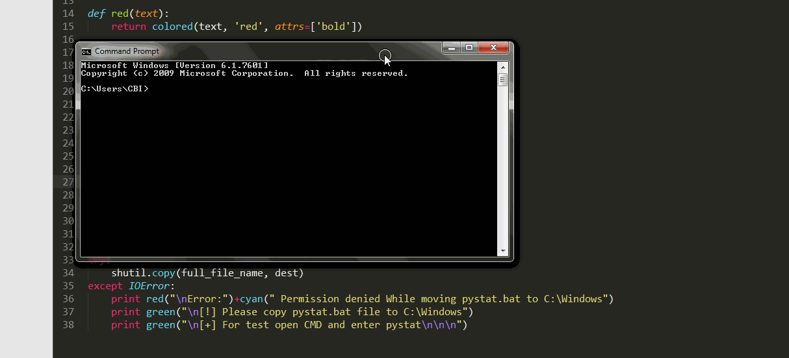

# PyStat - Advanced Netstat For Windows
#### Features
 * Know remote address of process
 * Know remote ports of process
 * Know which user using process along with title & PID

### Installation Guide:  
> Download the [.zip file](https://github.com/roothaxor/PyStat/archive/master.zip)

> Extract the pystat folder from .zip file to some drive i.e `C:\tools\pystat`

> Goto `C:\tools\pystat` Press SHIFT KEY + RIGHT CLICK and select open Command Window here

> Enter this command `python install.py`, Enjoy

 * Warning! Dont move pystat folder after installation, will stop working

#### In Work!

  

